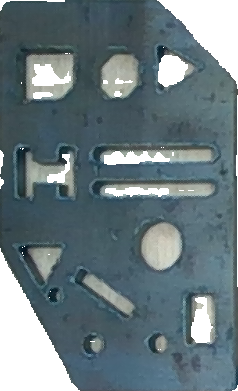
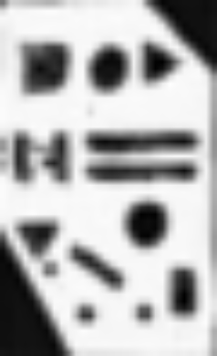
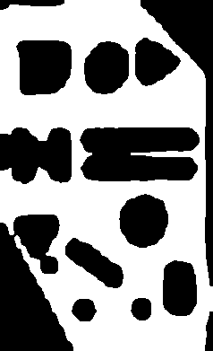
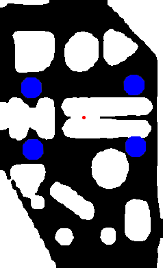
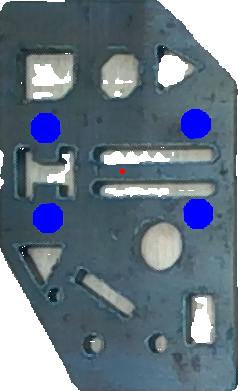

# Hackathon 2024 - Submission of Group *Darmstadt Intelligence Technologies*
Team members:
- Philipp Hinz
- Janina Fritzke
## Installation
In python 3.12, install the required packages using the following command:
```bash
pip install -r requirements.txt
```
Please also download the fine-tuned model from [here](https://drive.google.com/file/d/1yZR7h0FJKWJrmN4wQ2aYjTeRfUwfUd_K/view?usp=drive_link)
and replace it with the model in the 'solution' folder, because the model is too big for GitHub and does not work after down and uploading.

## Description
This project provides a solution for extracting the precise coordinates (x, y) and orientation (angle) 
of grippers from images of metal parts. Developed during a hackathon, it combines advanced deep learning 
for image segmentation, computer vision techniques for post-processing, and optimization methods to generate 
optimal gripper placements.

## Solution Overview
Here's an overview of the solution:

**1. Image Segmentation**:
We fine-tuned a DeepLabV3-Plus model to generate masks of the input image. 

**2. Post-Processing**:
The model's output was processed using thresholding and erosion to generate binary masks.

**3. Optimization**:
Using simulated annealing, we computed the optimal x, y, and angle.

## How to Run
To execute the solution, use the following command:
```bash
python solution/main.py path/to/input/tasks.csv output/solutions.csv
```

## Pipeline

### Step 1: Fine-Tuning the DeepLabV3-Plus Model

To achieve high-quality segmentation, we fine-tuned the DeepLabV3-Plus model (ResNet101 backbone) with custom masks:
- **Dataset Creation**: We hand-painted masks for 42 images, paired each mask with its original 
and inverted image, resulting in 84 image-mask pairs. Then, we augmented the data with 10 
variations per pair.
- **Training Setup**: The model was fine-tuned on Google Colab using an A100 GPU.

#### Example:
This is an example image mask pair, that was not used for training, but for validation.

*Model Input:*



*Training Label:*


*Model Output:*



### Step 2: Post-Processing
The model output is not a binary mask, so we applied thresholding and erosion to generate a 
binary mask.

#### Example:

*Post-Processed Output:*



### Step 3: Simulated Annealing
After generating binary masks, simulated annealing was used to optimize the x, y, and angle 
for the task. This technique efficiently explored the solution space, balancing exploration 
and exploitation.

#### Example:

*Gripper on Binary Mask:*



*Gripper on Original Image:*

"

## Decision Process

### Preprocessing Approaches to get binary mask
Several approaches were tested for preprocessing, including:

#### 1. Classical Computer Vision Techniques:
- Applied Gaussian blur, thresholding, and edge detection (Canny).
- These methods struggled with noisy, dusty images and were ultimately discarded.
- K-means clustering was also attempted but was not successful.

#### 2. UNet with ResNet34 backbone Fine-Tuning:
- Initial experiments with fine-tuning UNet with a ResNet34 backbone were conducted with a small dataset of 
10 hand-painted masks.
- The results were suboptimal, possibly due to limitations of the pre-trained model.

#### DeepLabV3-Plus with ResNet101 backbone Fine-Tuning (Final Approach):
- Provided better results than UNet, though post-processing was critical for achieving a usable binary mask.

#### Segment-Anything fine-tuning
- Tried to run a fine-tuning script on Google Colab, but was facing to many issues, so we could
not run it.
- Downloaded the vit_b (base) and vit_h (huge) pre-trained model to try it without fine-tuning.
The code was running so slowly on the CPU, that it was not an option to use it.

### Optimization Approaches for x, y, and Angle

We evaluated multiple strategies to compute x, y, and angle after obtaining binary masks:
#### 1. Brute Force:
- Evaluated all combinations of x, y, and angle. Computationally expensive and discarded.

#### 2. scipy.optimize.minimize:
- Leveraged the minimize function with a custom objective function. While promising, 
preprocessing bottlenecks limited its success.
- The objective function had similar ideas to the simulated annealing approach. It returned
inf if the gripper collided with the mask and the distance to the middle of the image if not.

#### 3. Improved Brute Force:
- Optimized brute force by using convolutions to identify potential positions. Still too slow 
for practical use.
- We tried to find all possible positions of a gripper, where one dot can fit using convolution
and then computed the distance between 2 of the dots in the gripper, created a mask with a circle
in data radius and checked with bitwise and which angles have a possible fitting next gripper dot.
With those angles we tried out the rest of the gripper dots for each returned angle to find the
angles where every dot in the gripper fits. But this was also very slow.

#### Simulated Annealing (Final Approach):
- Provided an efficient balance between exploration and exploitation.
- The starting point is always in the middel with an angle, so the gripper fits into the image.
- We run it 3 times and took the best result of the 3 runs.

## Challenges

### Computational Resources
One of the major challenges was securing sufficient GPU resources for fine-tuning:
- AWS: Initial attempts to rent a GPU on AWS were unsuccessful due to account 
restrictions. 
- Google Colab: Relied on Google Colab with paid A100 GPU access, as free-tier 
GPUs were insufficient for the intensive fine-tuning and debugging process.

### Small holes in the metal part
The model is not always able to detect all small holes properly.
